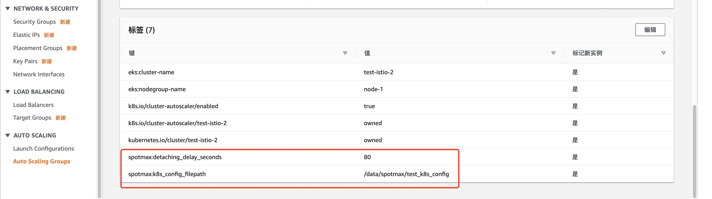
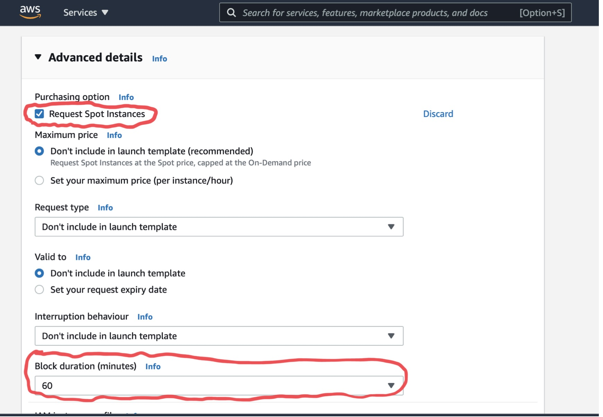

# AWS示例

## 热池功能

### 特点：

1、可根据伸缩组中的实例类型，在热 池中创建备用实例。当用户服务遭 遇中断时，可直接从热池调取备用 实例，更快完成补偿，保障业务稳定&#x20;

2、支持实例休眠，实例启动更快捷， 用户可实现秒级启动应用

### 逻辑：

.png>)

### 开启：

进入saas平台，选中左边导航栏<mark style="color:red;">MaxGroup</mark>，点击<mark style="color:red;">迁移</mark>选中要开启热池的ASG，点击<mark style="color:red;">配置</mark>，或者点击<mark style="color:red;">批量配置</mark>，配置热池功能：

.png>)

### 测试例子：

访问github地址：[https://github.com/spotmaxtech/test-aws-warn-pool](https://github.com/spotmaxtech/test-aws-warn-pool)

## 带有2块磁盘，需要继续保留非root盘：

.png>)

由于这里解决的是物理层磁盘挂载，而在系统中，需要对磁盘进行重新mount，这里提供自动化脚本植入系统，帮助完成系统层面的mount。

```
#!/bin/bash
EC2_REGION=`curl -s http://169.254.169.254/latest/dynamic/instance-identity/document|grep region|awk -F\" '{print $4}'`
INSTANCE_ID="`curl -s http://169.254.169.254/latest/meta-data/instance-id`"
aws ec2 describe-tags --filters "Name=resource-id,Values=$INSTANCE_ID" --region $EC2_REGION --output=text |grep spotmax:group &>/dev/null
if [ $? -ne 0 ] ;then
	exit 1
fi
MOUNT_PATH=$1
OLD_DEV=`lsblk|grep $MOUNT_PATH|awk '{print $1}'`
DEV_TYPE=`lsblk|grep $MOUNT_PATH|awk '{print $6}'`
while true
do
	NEW_DEV=`lsblk|grep $DEV_TYPE |grep -Ev "xvda|${OLD_DEV}|nvme0n1"|awk '{print $1}'`
	if [ ! -z $NEW_DEV ] ;then 
		umount $MOUNT_PATH &>/dev/null 
		sleep 1
		mount /dev/$NEW_DEV $MOUNT_PATH && break
	else
		sleep 3
	fi
done
```

## 需要consul解注册功能：

.png>)

## 需要k8s drain功能：

使用k8s用户需要进行如下两步操作：


1.在使用k8s的autoscaling上打上如下标签：

spotmax:k8s\_config\_file\_path    /data/spotmax/k8sconfig

spotmax:detaching\_delay\_seconds    80



2\. 需要给maxgroup所在的IAM role授权EKS的master权限，并导出k8sconfig，路径为：/data/spotmax/k8sconfig

```
#######以下命令在eks master上执行###########
kubectl describe configmap -n kube-system aws-auth   ###查看当前eks授权情况
kubectl edit -n kube-system configmap/aws-auth       ###编辑授权表，添加权限


# Please edit the object below. Lines beginning with a '#' will be ignored,
# and an empty file will abort the edit. If an error occurs while saving this file will be
# reopened with the relevant failures.
#
apiVersion: v1
data:
  mapRoles: |
    - groups:
      - system:masters
      rolearn: arn:aws:iam::<your aws account>:role/max_group_role
      username: system:node:{{EC2PrivateDNSName}}
      
 ######以下命令在maxgroup上执行##########     
aws eks --region <region-code> update-kubeconfig --name <cluster_name> --kubeconfig /data/spotmax/k8sconfig
```

## cloudwatch指标监控

cloudwatch集成了max\_group事件指标监控，可根据时间指标查询到max\_group的工作记录，如下图所示

.png>)

## Duration spot使用方法

### 处理时间保证

可以保证请求在被处理期间 (0-350分钟内) ，用于处理请求的实例不被中断。&#x20;

### 特点

* \-  应用无需做任何修改
*   \-  可以通过现有的形式进行服务发现/负责均衡/工作负责调度 (如:通过ELB/ALB/NLB，第三服务

    发现机制，K8S环境)
* \-  保持Autoscaling Group伸缩方式
*   \-  在Spot Instance无法获取时可以通过OnDemand进行补偿。待有符合要求的Spot instance后，

    OnDemand实例会被替换为对应Spot instance，以实现成本的持续节省 配置方式

### 方法配置

1\. 在启动模版(LaunchTemplate)中配置Spot Instance请求，并配置相应的Block Duration (Block Duration 须大于要保证的运行时间)

2\. 在AutoScaling使用该模版



3\. 针对以上AutoScaling Group添加以下Tag\
&#x20;spotmax:instance\_duration\_hours      1

spotmax:gurantee\_living\_mins: 50，（表示50分钟后，maxgroup会将替换新实例，此实例将下线）
