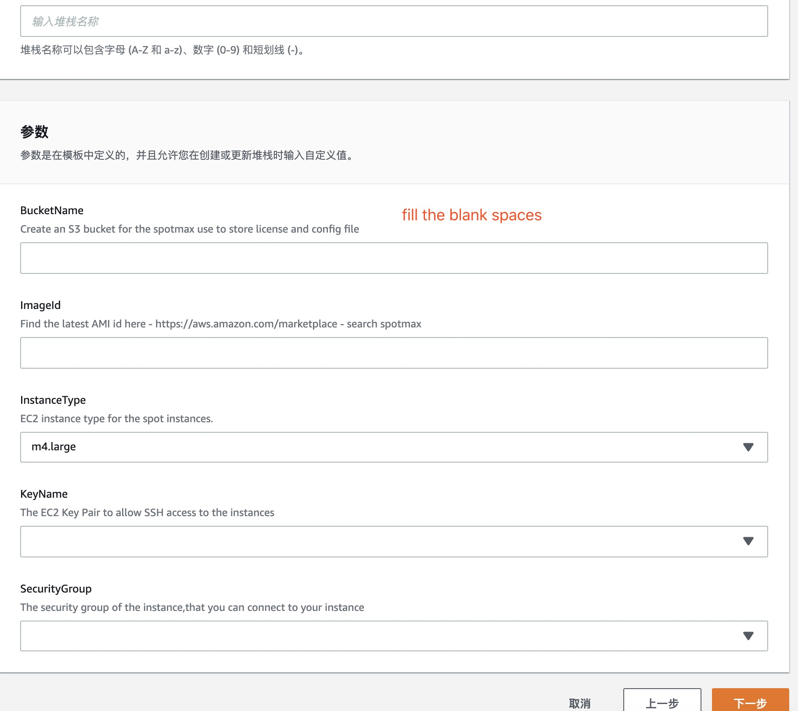

# How to use spotmax

## Install the spotmax

First of all, you must install all spotmax depends environment,here we support AWS cloudformation to deploy these.



When you use this template, you just need fill the blank spaces, and then the an instance will startup which has already installed the spotmax.




When the instance is ready, login and the service directory is /usr/local/spotmax

```
$ ls /usr/local/spotmax
conf  init.spotmax.sh  spotmax  spotmax.log  start.sh
```

config your autoscaling to the config file.

```
cat /usr/local/spotmax/conf/service_config.json 
......
  "groups":{
    "your autoscaling name":{
	    "consul_port":"8500",
	    "dettaching_delay_seconds":20,
        "max_num_of_terminated_one_time":2,
        "preaction_termination_delay_seconds":10,
        "preaction_detach_delay_seconds": 5,
        "is_enable_preaction":false,
        "persistence_dev":"/dev/sdf",
        "k8s_node_drain_option":false
  }
}
```

Options explain：

| options | explain |
| :--- | :--- |
| detaching\_delay\_seconds | when spot interrupt event triggered,how long you want to wait to detach tis instance,default is 20s |
| max\_num\_of\_terminated\_one\_time | max number your want to terminate instance number |
| preaction\_termination\_delay\_seconds | when precation your asg instance,how long you want to wait to terminate old instance,default is 10 |
| preaction\_detach\_delay\_seconds | when precation your asg instance,how long you want to wait to detach old instance,default is 10 |
| is\_enable\_preaction | precision is enable or not, default is false,this option is false make preaction\_termination\_delay\_seconds and preaction\_detach\_delay\_seconds disable |
| persistence\_dev | if you have and extra EBS don't want delete,use this option can remove EBS to an new startup instance |
| consul\_port | if you use consul,type port number here |
| k8s\_node\_drain\_option | if you use autoscaling for K8S,this option set true |

When you config the config file finished, you can start up spotmax by use the script **start.sh**

```text
./start.sh
#check the process spotmax
ps -ef|grep spotmax|grep -v grep
root      2868     1  0 Sep02 ?        00:20:42 ./spotmax -b s3-bucket-name -r ap-northeast-1
#check the log named spotmax.log
cat spotmax.log
time="2019-09-02T03:20:08Z" level=info msg="&{{} {{https://sqs.ap-northeast-1.amazonaws.com/xxxxxxxxx/spot-interruption-notice 61 5 1} {https://sqs.ap-northeast-1.amazonaws.com/xxxxxxxxxx/dettach-event 61 5 1} {https://sqs.ap-northeast-1.amazonaws.com/xxxxxxxxxx/preact-termination 61 5 1} 0 false  0} map[]}"
time="2019-09-02T03:20:08Z" level=debug msg="interruption sqs:https://sqs.ap-northeast-1.amazonaws.com/xxxxxxxxxxx/spot-interruption-notice"
time="2019-09-02T03:20:08Z" level=debug msg="Detach sqs:https://sqs.ap-northeast-1.amazonaws.com/xxxxxxxxxxxxxx/dettach-event"
time="2019-09-02T03:20:08Z" level=info msg="No persistence volume."
time="2019-09-02T03:20:08Z" level=info msg="start instance manager..."
time="2019-09-02T03:20:08Z" level=info msg="start interruption handler..."
time="2019-09-02T03:20:08Z" level=info msg="start dettach handler..."
time="2019-09-02T03:20:08Z" level=info msg="Starting instance attaching ..."
time="2019-09-02T03:20:09Z" level=info msg="start termination handler..."

```

