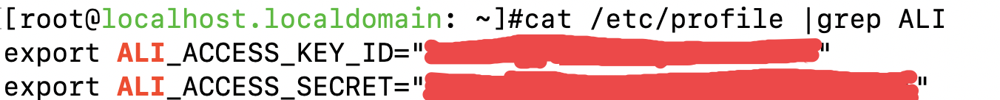

# 阿里云

### 设置AccessKey，支持三种方法

1、在/etc/profile中添加两条环境变量

**export ALI\_ACCESS\_KEY\_ID="XXXXXXXXXXXXXX"** 

**export ALI\_ACCESS\_SECRET="XXXXXXXXXXXXXX"** 



2、输入运行参数

如果license与maxgroup同一目录，直接运行如下：

```text
$./maxgroup -k key_id -p secret
```

如果license在其它目录需要指定路径

```text
$./maxgroup -L ./conf/license.txt -k key_id -p secret
```

3、添加目录

在home目录下添加.ali文件夹 ~/.ali，添加文件credentials，添加json格式内容


### 启动MaxGroup

上传完成，启动max\_group，使用./ali\_maxgroup可以查看启动所使用的参数

```text
$ ./ali_maxgroup
 -L string
        The license file path
  -k string
        [optional] the key of your AccessKeyId
  -p string
        [optional] the password of your AccessSecret
  -r string
        [optional] the region name
```

常规启动方式如下：

```text
$ ./ali_maxgroup -L ./conf/license.txt -k xxx-p xxx
```

启动成功，会看到以下日志输出:

```text
INFO[0001] group asg-xxxxxxxx is registered 
INFO[0001] start dettach handler...                     
INFO[0001] server started                               
INFO[0001] controller started                           
INFO[0001] global message receiver started              
INFO[0001] region us-east-1 instance manager started    
INFO[0001] Delay starting seconds 6                     
INFO[0007] Starting instance attaching ...    
```

