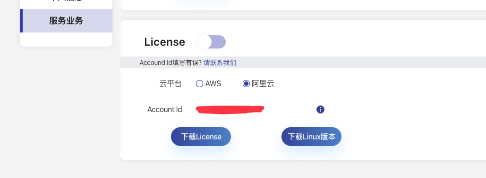

# 下载Max Group（AWS请使用上述cloudformation）

1、登录网站：[http://spotmax.mobvista.com/](http://spotmax.mobvista.com/)

2、注册/登录用户，点击[下载/购买](http://spotmax.mobvista.com/pricing)

3、如果使用Lite版本，直接点击下载即可，Pro版本请联系我们，SAAS版本目前只支持AWS

.png>)

4、输入Accound Id，绑定Max Group要运行所在的阿里云账号下，**注意：Accound Id输入后不能更改**

5、点击下载License与maxGroup程序，目前只支持linux x64版本，后续会添加更多的版本

6、License与maxGroup程序，须在同一个目录下
