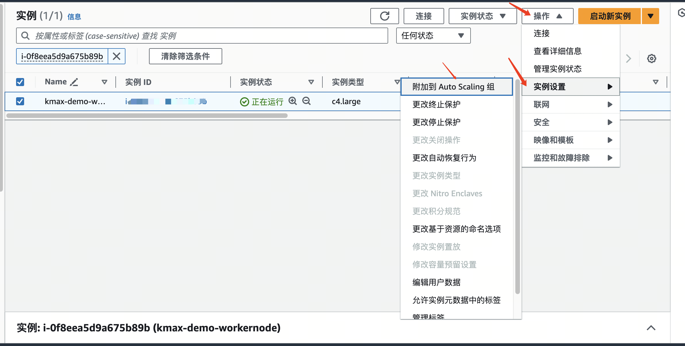

# 使用文档

## autoscaling配置

max\_group基于aws autoscaling工作，spot实例触发interrupt后，max\_group进行的一系列操作都依附于autoscaling，因此autoscaling的配置尤为重要，当前的autoscaling启动方式有两种，**启动配置**和**启动模板**，启动配置方式不适合使用多spot机型组合模式，因此，使用max\_group需要使用**启动模板**的方式启动autoscaling。

创建**启动模板**


#### 注意：启动模板中无法定义vpc和子网，但可以选择安全组，在选择安全组时，一定要选择将要在autoscaling使用的vpc相同的安全组。

创建**autoscaling**


其余配置与常规autoscaling配置相同。

已有autoscaling但使用了启动配置创建的autoscaling可以在编辑中修改为启动模板。


## max\_group依赖环境配置



上面附件提供了配置max\_group的依赖环境，使用aws的cloudformation安装即可。


连续**下一步**，直到**创建堆栈**

等待堆栈创建完成，即可安装使用max\_group。

## 权限配置

安装max\_group服务的instance需要对autoscaling进行管理，因此需要给instance一定权限，aws的instance推荐使用role的形式，上述cloudformation已经完成role的创建，只需要将 **spotmax\_max\_group\_role** 这个role附加到要安装max\_group的instance即可。

## 安装max\_group



max\_group为已编译完成的二进制包，无系统环境依赖，下载附件并解压，将得到二进制文件max\_group和conf目录并包含license.txt、seelog.xml和

```
$ unzip max_group.zip
$ tree
.
├── conf
│   ├── license.txt
│   ├── seelog.xml
│   └── service_config.json
├── max_group
└── max_group.zip
```

配置service\_config.json文件，替换配置文件中YOUR-REGION为所使用的region地址，如us-east-2，替换YOUR-AWS-ACCOUT为aws account ID，aws account为12位数字，登录aws console，在我的账号中可以查看账号ID，替换YOUR-ASG-NAME为索要使用的autoscaling名称，如spotmax\_k8s.一下为示例配置文件。

```
$ cat service_config.json
{
  "system":{

  },
  "global":{
		"interruption_evt_sqs":{
			"queue_url":"https://sqs.us-east-2.amazonaws.com/111111111111/spot-interruption-notice",
			"visibility_timeout_seconds":61,
			"max_number_of_messages":5,
			"wait_time_seconds":1,
      			"preaction_snapshot_interval_minutes":20
		},
		"detach_evt_sqs":{
			"queue_url":"https://sqs.us-east-2.amazonaws.com/111111111111/dettach-event",
			"visibility_timeout_seconds":61,
		  	"max_number_of_messages":5,
		  	"wait_time_seconds":1
		},
    		"termination_evt_sqs":{
      			"queue_url":"https://sqs.us-east-2.amazonaws.com/111111111111/preact-termination",
      			"visibility_timeout_seconds":61,
      			"max_number_of_messages":5,
      			"wait_time_seconds":1
    		},
    		"preaction_snapshot_interval_minutes":0
	},
  "groups":{
    "spotmax_k8s":{
        "detaching_delay_seconds":20,
        "max_num_of_terminated_one_time":2,
      	"preaction_termination_delay_seconds":10,
      	"preaction_detach_delay_seconds": 5,
        "is_enable_preaction":false
    }
  }
}
```

修改完成配置文件，将配置文件service\_config.json和经过spotmax授权的license.txt两个文件，上传至提供的s3 bucket。

```
$ aws s3 cp service_config.json  s3://YOUR-BUCKET/
$ aws s3 cp license.txt s3://YOUR-BUCKET/
```

## 启动max\_group

上传完成，启动max\_group，使用./max\_group可以查看启动所使用的参数

```text
$ ./max_group
region is required.
  -K string
    	k8s config file path
  -b string
    	S3 bucket for storing the MaxGroup config
  -k string
    	[optional] the key of your credential
  -l string
    	[optional] the log file
  -p string
    	[optional] the password of your credential
  -r string
    	the region name
  -t	[optional] local test mode
  -v	current version
```

常规启动如下：

```bash
$ ./max_group -b YOUR-S3-BUCKET -r ap-southeast-1
```

日志内容如下：

```text
INFO[0000]main.go:162 main.main() &{{} {{https://sqs.us-east-2.amazonaws.com/111111111111/spot-interruption-notice 61 5 1} {https://sqs.us-east-2.amazonaws.com/111111111111/dettach-event 61 5 1} {https://sqs.us-east-2.amazonaws.com/111111111111/chao-preact-test 61 5 1} 0 false arn:aws:iam::111111111111:role/spotmax_max_group_role 0} map[spotmax-k8s:{ 45  2 10 5 false 0 false false} 
DEBU[0000]autoscaling.go:257 gitlab.mobvista.com/spotmax/max_api/pkg/autoscaling.(*AutoScaling).SuitableForMaxGroup() group spotmax-k8s is suitable for max group 
INFO[0000]main.go:200 main.main() Loaded maxgroup spotmax-k8s
DEBU[0000]main.go:205 main.main() interruption sqs:https://sqs.us-east-2.amazonaws.com/111111111111/spot-interruption-notice 
DEBU[0001]main.go:206 main.main() Detach sqs:https://sqs.us-east-2.amazonaws.com/111111111111/dettach-event                     
INFO[0001]main.go:229 main.main() start instance manager...                    
INFO[0001]main.go:235 main.main() start interruption handler...                
INFO[0001]main.go:241 main.main() start dettach handler...                     
INFO[0001]unified_instance_manager.go:303 gitlab.mobvista.com/spotmax/max_group.(*UnifiedInstanceManager).Process() Delay starting seconds 0                     
INFO[0001]unified_instance_manager.go:306 gitlab.mobvista.com/spotmax/max_group.(*UnifiedInstanceManager).Process() Starting instance attaching ...              

```

这样max\_group就启动完成了

### 磁盘漂移功能

由于spot instance被竞走后，源instance包括其自带的ebs也会被回收掉，因此max\_group支持额外挂载的ebs迁移到新instance功能，以下为推荐改造方案。

#### 创建带两块磁盘镜像

新创建一个镜像，镜像要求有两个EBS，一个根卷，一个外挂附属卷。


系统中，将另一块盘mount到指定目录，示例如下：

```text
#使用的附属卷如是从指定snapshot创建，则已经进行过格式化，可以直接使用，如果未从任意snapshot创建，则需要先进行格式化
$ lsblk
NAME    MAJ:MIN RM  SIZE RO TYPE MOUNTPOINT
xvda    202:0    0  100G  0 disk 
└─xvda1 202:1    0  100G  0 part /
xvdf    202:80   0  400G  0 disk /mnt
```

推荐自定义一个初始化脚本，放置在s3，在系统中定义reboot 计划任务，拉去s3上初始化脚本执行初始化，这样可以在系统有更新是通过初始化脚本更新而无需重做镜像。

```text
$ crontab -l
......
@reboot  aws s3 cp s3://YOUR-INIT-SCRIPT-BUCKET/init_script /opt/ && cd /opt/init_script && sh init_script.sh
......
```

#### 基于新镜像制作模板并创建autoscaling

镜像制作完成后，基于两个EBS镜像，制作启动模板，制作方法跟教程开始制作模板相同。完成后，基于新镜像创建或修改autoscaling使用新的启动模板。

**注意：max\_group只能进行aws层面磁盘转移，系统内部的mount无法进行，这里推荐使用模板中的高级选项的data来植入一个脚本实现mount转移。这里采用了 tag功能，因此给模板内实例需要有get tag的IAM role。**


```text
#!/bin/bash
EC2_REGION=`curl -s http://169.254.169.254/latest/dynamic/instance-identity/document|grep region|awk -F\" '{print $4}'`
INSTANCE_ID="`curl -s http://169.254.169.254/latest/meta-data/instance-id`"
TARGET_DIR="/data"
aws ec2 describe-tags --filters "Name=resource-id,Values=$INSTANCE_ID" --region $EC2_REGION --output=text|grep spotmax:group &>/dev/null
if [ $? -eq 0 ] ;then
    while true
    do
        sleep 1
        lsblk |grep xvdz &>/dev/null
        if [ $? -eq 0 ] ;then
            df -h |grep $TARGET_DIR &>/dev/null
            if [ $? -eq 0 ] ;then
                umount $TARGET_DIR
            else 
                mount /dev/xvdz1 $TARGET_DIR
                break
            fi
        fi
    done
fi
```

#### 修改max\_group配置并上传s3后重启服务

修改配置文件service\_config.json中groups部分,增加**persistence\_dev**选项，例如附属卷为/dev/sdf,修改配置如下

```text
 ......
 "groups":{
    "YOUR-ASG-NAME":{
	    "dettaching_delay_seconds":20,
        "max_num_of_terminated_one_time":2,
        "preaction_termination_delay_seconds":10,
        "preaction_detach_delay_seconds": 5,
        "is_enable_preaction":false,
        "persistence_dev":"/dev/sdf"
  }
}
```

修改完成后，将配置上传到s3，并重启服务。

重启后日志含有persistence volume内容

```text
......
time="2019-09-17T12:05:15Z" level=info msg="Has persistence volume." func="main.main()" file="main.go:216"
......
```

### k8s节点漂移

EKS用户基于autoscaling也可以使用max\_group应对spot被竞走情况，spot被竞走前2分钟会有事件发出，需要在事件发出后新起一个node，并把将要被竞走的node上的pod驱赶到新node上来，实现无缝切换。EKS部署部分不再进行详细说明，如对EKS感兴趣请查看AWS官方文档。

修改配置文件service\_config.json中groups部分，增加**k8s\_node\_drain\_option**选项，如下：

```
......
  "groups":{
    "your autoscaling name":{
	    "dettaching_delay_seconds":20,
        "max_num_of_terminated_one_time":2,
        "preaction_termination_delay_seconds":10,
        "preaction_detach_delay_seconds": 5,
        "is_enable_preaction":false,
        "k8s_node_drain_option":true
  }
}
```

修改完成后，将配置上传到s3，并重启服务。

### consul支持

使用consul服务，可以对max\_group管理机暴露服务端口，max\_group可以通过暴露的端口将被竞走instance注销。

修改配置文件service\_config.json中groups部分，增加**consul\_port**选项，如暴露的端口为8500，修改配置如下：

```text
......
  "groups":{
    "your autoscaling name":{
	    "dettaching_delay_seconds":20,
        "max_num_of_terminated_one_time":2,
        "preaction_termination_delay_seconds":10,
        "preaction_detach_delay_seconds": 5,
        "is_enable_preaction":false,
        "consul_port":"8500"
  }
}
```

修改完成后，将配置上传到s3，并重启服务。

### 配置文件groups中选项解释

| options | explain |
| :--- | :--- |
| detaching\_delay\_seconds | when spot interrupt event triggered,how long you want to wait to detach tis instance,default is 20s |
| max\_num\_of\_terminated\_one\_time | max number your want to terminate instance number |
| preaction\_termination\_delay\_seconds | when precation your asg instance,how long you want to wait to terminate old instance,default is 10 |
| preaction\_detach\_delay\_seconds | when precation your asg instance,how long you want to wait to detach old instance,default is 10 |
| is\_enable\_preaction | precision is enable or not, default is false,this option is false make preaction\_termination\_delay\_seconds and preaction\_detach\_delay\_seconds disable |
| persistence\_dev | if you have and extra EBS don't want delete,use this option can remove EBS to an new startup instance |
| consul\_port | if you use consul,type port number here |
| k8s\_node\_drain\_option | if you use autoscaling for K8S,this option set true |

### 手动验证

利用spot的fleet增加和减少instance数量可以触发interrupt事件，因此使用fleet来手动验证interrupt后，max\_group的工作情况。

#### 创建fleet




创建fleet完成后，可以查看fleet中启动的instance。等待instance状态为running后，将instance attach到autoscaling中


附加到asg后，修改fleet数量，让机器数量减少而出发interrupt。


提交以后，max\_group就开始工作了，等待instance replace结束，可以在autoscaling的**活动历史记录**中查看替换详情


## 结语

以上为max\_group部署配置全过程，如使用中有任何问题，请使用xxx联系我们。

