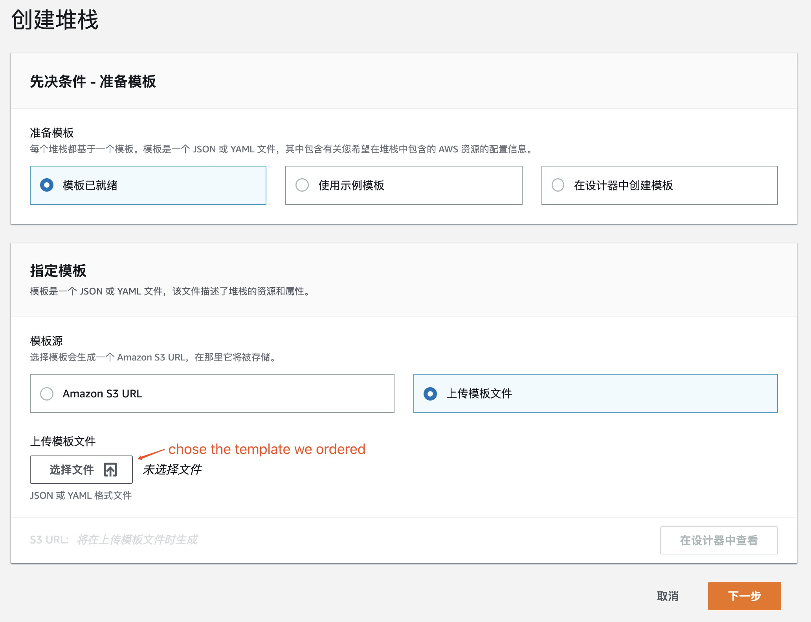

# 依赖环境配置

### 依赖配置



上面附件提供了配置MaxGroup的依赖环境，使用AWS的CloudFormation安装即可。

### 权限配置

安装MaxGroup服务的instance需要对AutoScalingGroup进行管理，因此需要给instance一定权限，AWS的instance推荐使用role的形式，上述CloudFormation已经完成role的创建，只需要将 **spotmax\_max\_group\_role**这个role附加到要安装MaxGroup的instance即可。

以上就完成了部署MaxGroup的前期准备工作。

